# Documentação de Dependências - Data Warehouse Sienge

## Visão Geral

Este documento mapeia todas as dependências entre as views materializadas do Data Warehouse Sienge, seguindo a arquitetura Medallion (Bronze → Silver → Gold).

**Data de criação:** 2025-09-19
**Versão:** 1.0
**Autor:** Sistema de Data Warehouse Sienge

---

## 🏗️ Arquitetura de Dependências

```mermaid
graph TB
    subgraph BRONZE["🥉 BRONZE SCHEMA"]
        B1[clientes]
        B2[contratos_venda]
        B3[empreendimentos]
        B4[empresas]
        B5[centro_custos]
        B6[extrato_contas]
        B7[extrato_apropriacoes]
        B8[planos_financeiros]
        B9[unidades]
        B10[cliente_telefones]
        B11[cliente_enderecos]
        B12[contrato_clientes]
        B13[contrato_unidades]
    end

    subgraph SILVER["🥈 SILVER SCHEMA"]
        S1[rpt_sienge_core]
        S2[rpt_sienge_financeiro]
    end

    subgraph GOLD["🥇 GOLD SCHEMA"]
        G1[rpt_sienge_clientes_completo]
        G2[rpt_sienge_contratos_detalhado]
    end

    B1 --> S1
    B2 --> S1
    B3 --> S1
    B4 --> S1

    B5 --> S2
    B6 --> S2
    B7 --> S2
    B8 --> S2

    B1 --> G1
    B2 --> G1
    B10 --> G1
    B11 --> G1
    B12 --> G1

    B2 --> G2
    B3 --> G2
    B4 --> G2
    B9 --> G2
    B12 --> G2
    B13 --> G2

    style BRONZE fill:#cd7f32,color:#fff
    style SILVER fill:#c0c0c0,color:#000
    style GOLD fill:#ffd700,color:#000
```



---

## 📊 Mapeamento Detalhado por View

### 🥈 SILVER SCHEMA

#### `silver.rpt_sienge_core`

**Propósito:** View unificadora com campos separados por domínio

**Dependências Diretas:**

- `bronze.clientes` - Dados de clientes
- `bronze.contratos_venda` - Contratos de venda
- `bronze.empreendimentos` - Empreendimentos
- `bronze.empresas` - Empresas/construtoras

**Campos Principais:**

- 6 campos comuns (domain_type, unique_id, data_principal, ano, mes, ano_mes)
- 25 campos específicos por domínio

**Refresh Order:** 1º (Base para outras views)

#### `silver.rpt_sienge_financeiro`

**Propósito:** Dados financeiros e extratos consolidados

**Dependências Diretas:**

- `bronze.centro_custos` - Centros de custo
- `bronze.extrato_contas` - Extratos de contas
- `bronze.extrato_apropriacoes` - Apropriações financeiras
- `bronze.planos_financeiros` - Planos e classificações financeiras

**Campos Principais:**

- Movimentações financeiras detalhadas
- Classificações e categorizações
- Análises de fluxo de caixa

**Refresh Order:** 2º (Independente do core)

---

### 🥇 GOLD SCHEMA

#### `gold.rpt_sienge_clientes_completo`

**Propósito:** Visão 360° dos clientes com análises avançadas

**Dependências Diretas:**

- `bronze.clientes` - Dados principais dos clientes
- `bronze.contratos_venda` - Para análise de relacionamentos
- `bronze.cliente_telefones` - Múltiplos telefones
- `bronze.cliente_enderecos` - Múltiplos endereços
- `bronze.cliente_procuradores` - Procuradores
- `bronze.cliente_renda_familiar` - Composição de renda
- `bronze.contrato_clientes` - Relacionamento cliente-contrato

**Campos Principais:**

- 70+ campos com análise de completude
- JSONBs estruturados (telefones, endereços, renda)
- Indicadores calculados (idade, tempo como cliente)
- Métricas de relacionamento com contratos

**Refresh Order:** 3º (Depende indiretamente do core)

#### `gold.rpt_sienge_contratos_detalhado`

**Propósito:** Análise completa de contratos com métricas de negócio

**Dependências Diretas:**

- `bronze.contratos_venda` - Dados principais dos contratos
- `bronze.empreendimentos` - Dados do empreendimento
- `bronze.empresas` - Empresa/construtora responsável
- `bronze.unidades` - Unidades vendidas
- `bronze.contrato_clientes` - Clientes do contrato
- `bronze.contrato_unidades` - Relacionamento contrato-unidade
- `bronze.contrato_condicoes_pagamento` - Condições de pagamento

**Campos Principais:**

- 85+ campos especializados
- JSONBs estruturados (clientes, unidades, comissões)
- Indicadores de performance de vendas
- Análises financeiras avançadas

**Refresh Order:** 4º (Depende de múltiplas fontes)

---

## ⚡ Ordem de Refresh Recomendada

### Sequência Padrão (Dependências)

```sql
-- FASE 1: SILVER (Views independentes)
REFRESH MATERIALIZED VIEW silver.rpt_sienge_core;
REFRESH MATERIALIZED VIEW silver.rpt_sienge_financeiro;

-- FASE 2: GOLD (Views especializadas)
REFRESH MATERIALIZED VIEW gold.rpt_sienge_clientes_completo;
REFRESH MATERIALIZED VIEW gold.rpt_sienge_contratos_detalhado;
```

### Sequência Otimizada (Paralela quando possível)

```sql
-- PARALELO: Views SILVER independentes
BEGIN;
  REFRESH MATERIALIZED VIEW silver.rpt_sienge_core;
  REFRESH MATERIALIZED VIEW silver.rpt_sienge_financeiro;
COMMIT;

-- PARALELO: Views GOLD independentes entre si
BEGIN;
  REFRESH MATERIALIZED VIEW gold.rpt_sienge_clientes_completo;
  REFRESH MATERIALIZED VIEW gold.rpt_sienge_contratos_detalhado;
COMMIT;
```

---

## 🔄 Matriz de Impactos

### Quando uma tabela BRONZE é alterada:

| Tabela Bronze     | Impacta Silver | Impacta Gold                                   | Ação Requerida                     |
| ----------------- | -------------- | ---------------------------------------------- | ---------------------------------- |
| `clientes`        | ✅ core        | ✅ clientes_completo                           | Refresh core → clientes_completo   |
| `contratos_venda` | ✅ core        | ✅ clientes_completo<br>✅ contratos_detalhado | Refresh core → ambas Gold          |
| `empreendimentos` | ✅ core        | ✅ contratos_detalhado                         | Refresh core → contratos_detalhado |
| `empresas`        | ✅ core        | ✅ contratos_detalhado                         | Refresh core → contratos_detalhado |
| `extrato_contas`  | ✅ financeiro  | ❌                                             | Refresh financeiro apenas          |
| `centro_custos`   | ✅ financeiro  | ❌                                             | Refresh financeiro apenas          |
| `unidades`        | ❌             | ✅ contratos_detalhado                         | Refresh contratos_detalhado        |

### Tempo Estimado de Refresh (Ambiente Atual):

| View                                  | Tamanho | Registros | Tempo Estimado | Dependências     |
| ------------------------------------- | ------- | --------- | -------------- | ---------------- |
| `silver.rpt_sienge_core`              | 440 KB  | 1.514     | ~0.07s         | 4 tabelas Bronze |
| `silver.rpt_sienge_financeiro`        | 62 MB   | 51.801    | ~2-5s          | 4 tabelas Bronze |
| `gold.rpt_sienge_clientes_completo`   | 1.6 MB  | 825       | ~0.3s          | 7 tabelas Bronze |
| `gold.rpt_sienge_contratos_detalhado` | 2 MB    | 689       | ~0.5s          | 7 tabelas Bronze |

**Tempo Total Sequencial:** ~3-6 segundos
**Tempo Total Paralelo:** ~2-5 segundos

---

## 🚨 Alertas de Dependência

### Problemas Identificados:

1. **Self-references:** Algumas views referenciam a si mesmas (normal em materialized views)
2. **Cascata de Impactos:** Alteração em `contratos_venda` afeta 3 views
3. **Dependência Crítica:** `silver.rpt_sienge_core` é base para análises

### Recomendações:

1. **Monitoramento:** Alertar se refresh de views dependentes falha
2. **Rollback:** Manter backups antes de refresh em lote
3. **Performance:** Considerar índices únicos para refresh CONCURRENT

---

## 📝 Procedures de Manutenção

### Verificar Dependências Quebradas:

```sql
-- Verificar views que falharam no último refresh
SELECT * FROM system.sync_logs
WHERE "entityType" LIKE 'REFRESH_VIEW_%'
AND status = 'error'
AND "syncStartedAt" > CURRENT_TIMESTAMP - INTERVAL '24 hours';
```

### Refresh Inteligente por Dependência:

```sql
-- Usar a function criada que respeita dependências
SELECT * FROM refresh_all_datawarehouse_views();
```

### Verificar Integridade:

```sql
-- Comparar contagens entre Bronze e views derivadas
SELECT
  'BRONZE' as layer, 'contratos_venda' as source, COUNT(*) as records
FROM bronze.contratos_venda
UNION ALL
SELECT
  'SILVER', 'core_contratos', COUNT(*)
FROM silver.rpt_sienge_core WHERE domain_type = 'contratos'
UNION ALL
SELECT
  'GOLD', 'contratos_detalhado', COUNT(*)
FROM gold.rpt_sienge_contratos_detalhado;
```

---

## 🔮 Próximas Views (Roadmap)

### Views Planejadas e suas Dependências:

#### `gold.rpt_sienge_unidades_detalhado` (Em desenvolvimento)

**Dependências Esperadas:**

- `bronze.unidades`
- `bronze.unidade_agrupamentos`
- `bronze.unidade_valores_especiais`
- `bronze.unidade_filhas`
- `bronze.empreendimentos`

#### `gold.rpt_sienge_empreendimentos_completo` (Em desenvolvimento)

**Dependências Esperadas:**

- `bronze.empreendimentos`
- `bronze.unidades` (agregação)
- `bronze.contratos_venda` (métricas de vendas)

#### `analytics.rpt_sienge_agregacoes_financeiras` (Planejada)

**Dependências Esperadas:**

- `silver.rpt_sienge_financeiro`
- `gold.rpt_sienge_contratos_detalhado`

---

## 📚 Documentos Relacionados

- [Arquitetura do Data Warehouse](datawarehouse_architecture.md)
- [Scripts de Criação das Views](sql/)
- [Procedures de Refresh](sql/32_criar_procedures_refresh.sql)
- [Monitoramento de Performance](sql/33_criar_monitoramento_performance.sql)

---

_Última atualização: 2025-09-19_
_Versão: 1.0_
_Mantido por: Sistema de Data Warehouse Sienge_
